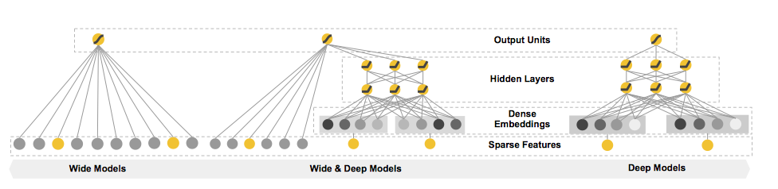

### Wide and Deep论文阅读笔记

#### 摘要

具有非线性特征变换的广义线性模型被广泛用于稀疏输入的大规模回归和分类问题。这种方法属于Wide类型。Wide Model具有的特点：1）有效且可解释性好；2）需要更多的特征工程和特征组合

而深度神经网络属于Deep Model。Deep Model的特点是：1）更少的特征工程；2）通过将稀疏特征转为低维稠密向量，泛化性能更强；3）可解释性差，冷启动时推荐效果差

本文提出了Wide & Deep Learning，联合训练线性模型和深度神经网络，以结合推荐系统的记忆和泛化优势。

同时在Google Play移动应用程序商店中应用和评估了该模型。在线实验结果表明，相比wide-only和deep-only模型，wide&deep模型中应用程序的获取量显着增加。wide&deep代码已在TensorFlow中开源。

#### 介绍

Memorization vs Generalization

Memorization：学习item和feature的经常共现，探索利用历史数据中的相关关系；

Generalization：更加倾向于提高推荐的多样性。

感觉类似E&E，Exploration & Exploitation。

诸如LR这类广义线性模型的优点：简单、可扩展、可解释性好。但对于cross-product转换存在局限：对于训练数据中未出现过的query-item特征对，其泛化性能不佳。

诸如factorization machines和深度神经网络的嵌入式模型的优点：可以通过为每个query-item特征对学习低维稠密向量，对训练集中未出现过的query-item特征对进行泛化，从而减轻了特征工程的负担。但对有些有特定偏好的用户或有些受众较小的items，此时query-item特征对的矩阵很稀疏且是高阶的，很难学到有效的低维向量表示。在这种情况下，大多数query-item特征对之间不应存在任何交互，但是稠密向量将导致所有query-item特征对的预测都为非零，可能过于笼统，导致不相关的推荐发生。而对于一些带有交叉乘积特征变换的线性模型则可以用更少的参数来记住这些“例外规则”。

本文的贡献：

1）提出了Wide&Deep学习框架联合训练线性模型和深度神经网络，用于输入稀疏的推荐系统。

2）在活跃用户超过10亿、应用程序超过100万的Google Play上进行实验评估所提出模型的有效性。

3）在TensorFlow中开源了Wide&Deep实现代码。

#### Wide & Deep Learning

#### 系统实现&实验结果

#### 结论

Wide & Deep模型结合了线性模型的记忆和神经网络的泛化优势，在线实验结果显示，wide&deep模型的效果相比wide-only和deep-only模型有显著提升。

