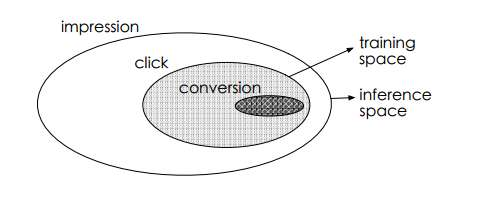
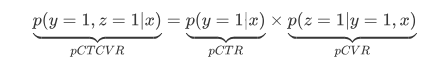
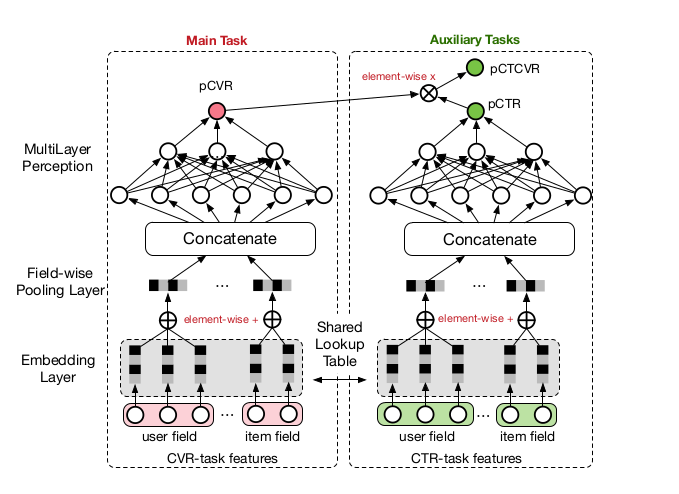
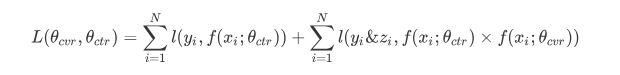
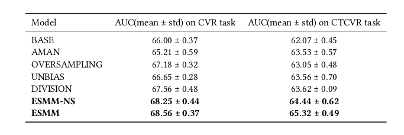
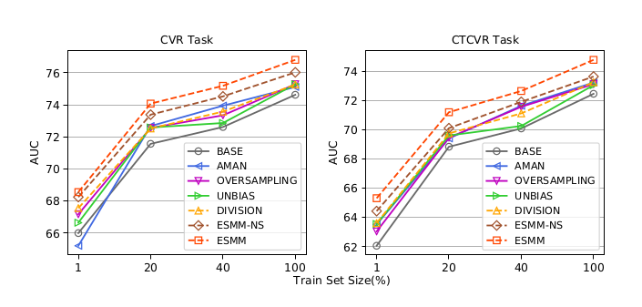

## ESMM论文阅读笔记

### 1. 论文摘要

准确地预估**点击转化率**（post-click conversion rate, CVR）对推荐和广告等工业应用中的排名系统至关重要。

传统的CVR模型使用了流行的深度学习方法，达到了state of the art的性能。然而在实践中遇到了几个与任务相关的具体的问题，使得CVR建模具有一定的挑战。具体如下：1）传统CVR模型使用点击了的浏览样本（samples of clicked impressions）进行训练，同时却对使用所有的浏览样本(samples of all impressions)的整个空间(entire space)进行推断，这会导致**样本选择偏差问题**（sample selection bias problem）; 2）存在极端的**数据稀疏问题**（data sparsity），使得模型拟合相当困难。此外，其实在CVR预估中还存在其他问题，如延时反馈（delayed feedback）的问题，不在本文的讨论之内。

这篇论文中，通过充分利用用户操作的顺序模式，即浏览→点击→购买，以全新的视角对CVR进行建模，提出的ESMM（Entire Space Multi-task Model）模型可以通过下面的方法解决上述两个问题：1）直接在整个空间进行建模；2）采用特征表示转移学习策略（feature representation transfer learning strategy）。

从淘宝推荐系统的流量日志中收集的数据集实验表明，ESMM优于其他方法。同时该团队还发布了该数据集的采样版本，这是第一个包含可用于CVR建模的点击转换标签的序列依赖公共数据集。

### 2. 主要介绍

**转化率预估**是工业应用（如在线广告、推荐）中的排序系统的重要任务，预测的CVR可用于OCPC广告以调整每次点击的出价来实现平台和广告商的双赢。在推荐系统中，它也是衡量用户点击偏好和购买偏好的重要因素。

本文主要专注于点击转化率预估，为简化讨论，本文以对电商网站推荐系统为例进行CVR建模，给定特定的推荐商品，用户可能会点击感兴趣的项目，进而购买其中的一些。换句话说，用户的行为遵循顺序模式：浏览→点击→购买，因此CVR建模指的是估计点击转化率，即
$$
pCVR = p(conversion|click,impression)
$$
传统的CVR建模方法存在的两个问题：1）样本选择偏差问题（SSB），如下图所示，模型在经过点击了的浏览样本空间内进行训练，同时却在所有的浏览样本空间进行推断，SSB问题损害了训练模型的泛化性能。

    

2）数据稀疏性（DS）问题。在实践中，为训练CVR模型所收集的数据远少于CTR任务。训练数据的稀疏性使得CVR模型的拟合相当困难。

**相关研究**:略。

本文的ESMM方法中，介绍了两个辅助任务：预测点击率$pCTR$、预测点击且转化的概率$pCTCVR$。ESMM并不直接用已经点击的浏览样本训练CVR模型，而是将$pCVR$视为中间变量，乘以$pCTR$等于$pCTCVR$。在所有的浏览样本的整个空间上预测$pCTCVR$和$pCTR$，因此可知$pCVR$也适用于整个空间。所以，因此样本选择偏差（SSB）问题得以解决。此外，CVR网络的特征表示参数和CTR网络共享，后者可以使用更庞大的样本进行训练。这种共享参数的迁移学习策略可以显著环缓解数据稀疏（DS）问题。

**数据集**：来自淘宝推荐系统的流量日志数据，完整数据集包括89亿个样本及其对应的序列标签(点击和转化)。

### 3. 具体方法 

假设数据集表示为$ S={(x_i,y_i)\rightarrow z_i}\mid_{i=1}^N$，其中样本$(x,y\rightarrow z）$是从分布$D$中采样得到的，域为$X\times Y\times Z $，其中X为特征空间，Y和Z是标签空间,$N$是所有浏览样本的数量，$x$表示浏览样本的特征向量，通常是高维稀疏向量，含多个域如user_field、item_field等，$y$和$z$是binary标签，非0即1。

点击转化率的估计可以表示为 $pCVR=p(z=1|y=1,x)$，此外点击率为 $pCTR=p(y=1|x)$,点击且转化的概率为 $pCTCVR=p(y=1,z=1|x)$,因此，给定浏览样本$x$,有如下公式：

     

**ESMM模型介绍**：

    

ESMM模型图如上所示，充分利用了用户操作的序列模式，并借鉴了多任务学习的思路，引入两个辅助任务CTR、CTCVR，消除了样本选择偏差和数据稀疏的问题。

给定一个浏览样本（曝光样本），ESMM会同时计算输出pCTR、pCVR以及PCTCVR。CVR网络如上图左侧所示，CTR网络如上图右侧所示，他们拥有相同的网络结构。由下式可知，ESMM在整个空间上建模：
$$
p(z=1|y=1,x)=\frac{p(y=1,z=1|x)}{p(y=1|x)}
$$
由上式可知，通过预测pCTR、pCTCVR，可以求得pCVR，其中pCTR和pCTCVR都是在整个样本空间进行计算，这消除了样本选择偏差问题，但单独计算pCTCVR和pCTR后按照除法得到pCVR时，由于pCTR是个很小的数值，进行除法会出现数值不稳定问题，在ESMM中是按照乘法形式避免此问题，ESMM中，pCVR只是一个中间变量，它受乘法公式的约束，pCTR和pCTCVR才是ESMM在整个样本空间估计的主要内容，乘法形式使得三个关联的、共同训练的估计器能够利用数据的顺序模式，并在训练期间彼此交流信息。此外，它确保了估计的pCVR的值在[0,1]的范围内，但在除法中可能超过1。

ESMM模型的损失函数定义如下：

    

其中$\theta_{ctr}$和$\theta_{cvr}$是CTR和CVR网络的参数，$l(·)$表示交叉熵。

在ESMM模型中，Embedding层将大规模稀疏输入映射为低维度稠密向量，且CVR网络和CTR网络共享词嵌入字典，遵循特征表示迁移学习范式，这使得ESMM中的CVR网络可以从未点击的浏览样本中学习，并为缓解数据稀疏问题提供了很大帮助。在ESMM模型中两个子网络如果替换为更加先进的模型可能会取得更好的效果。

### 4. 实验部分

在一部分公开数据集和淘宝实际数据集上进行了实验，并对比了其他6个模型，采用AUC作为评价指标，无论是在CVR任务还是CTCVR任务上，ESMM都取得了最好的效果，详细实验数据如下所示：

公开数据集上的实验结果：

    

 工业数据集上的实验结果：

    

   

### 5. 展望

未来可以考虑设计全局优化模型，涉及多阶段动作序列，如请求→浏览曝光→点击→转化。
