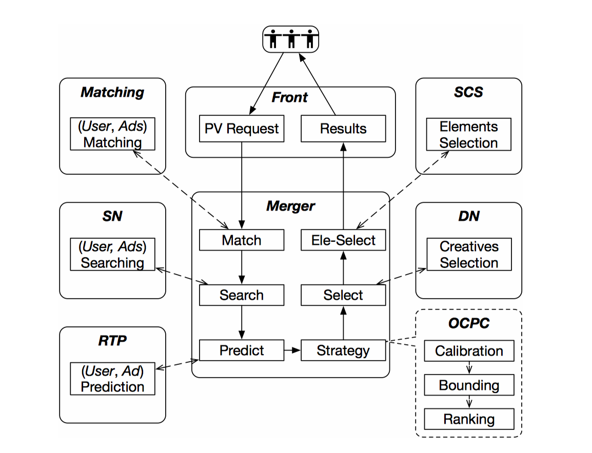
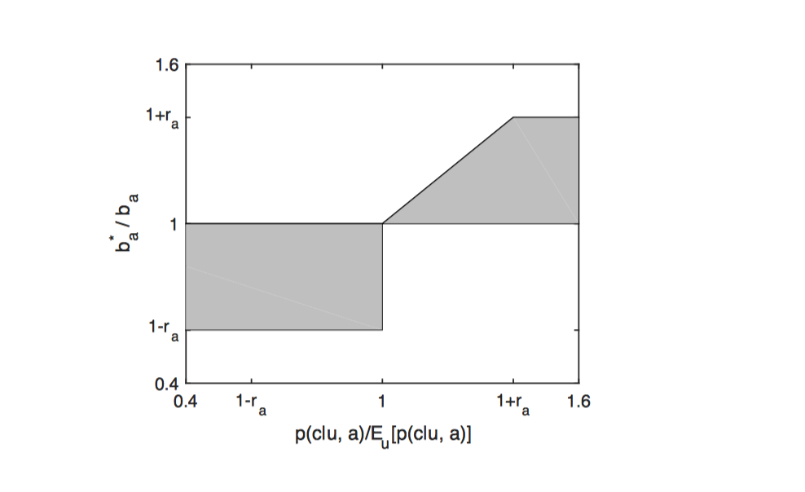
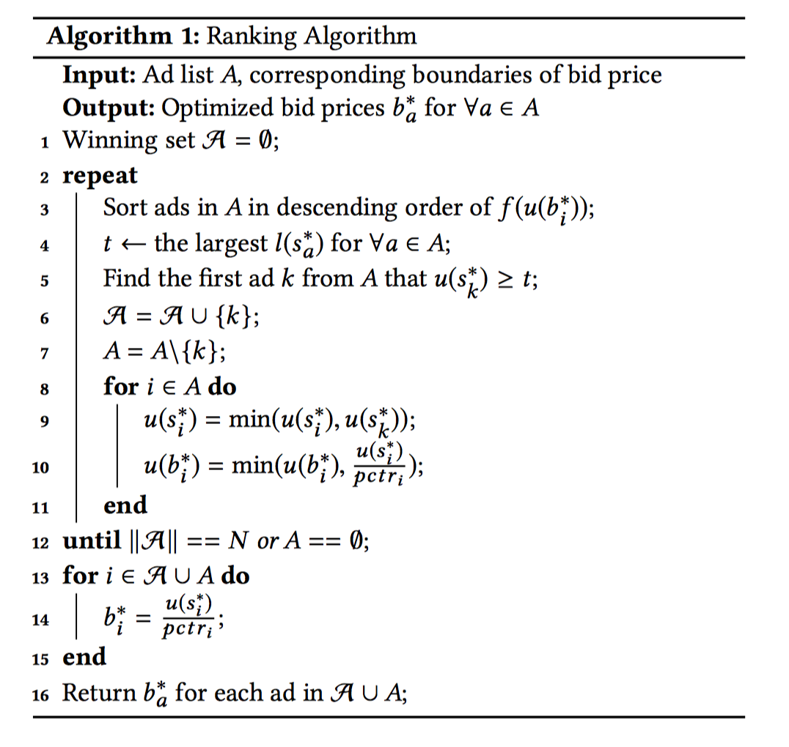
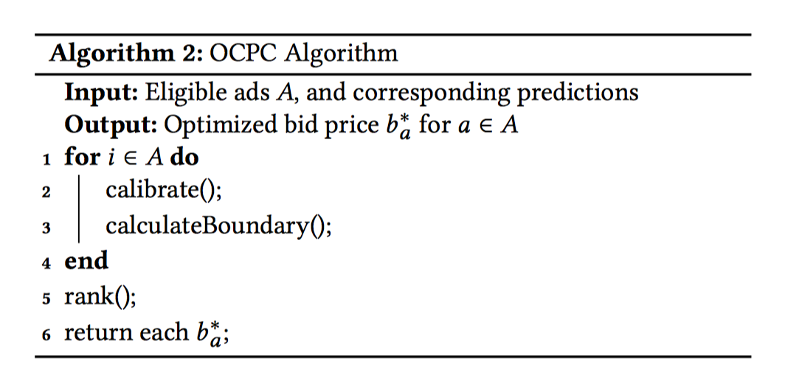
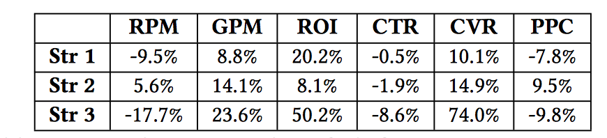
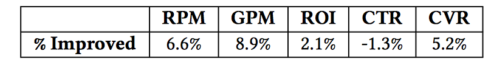

## OCPC论文阅读笔记

[TOC]

### 0. 准备知识

`pCTR`：预估点击率 	`pCVR`：点击转化率		`bid`：广告出价

`CPC`：按点击计费（cost per click）  `CPM`：按每一千人展示计费（cost per mille）

`ROI`：投资回报率      `GMV`：电商网站成交总额	`GPM`：广告千次展示给广告主带来的GMV

`RPM`：广告千次展示给广告平台带来的收益，可用来衡量广告平台的流量变卖、转化效率

`PPC`：pay-per-click，每次点击的成本

OCPC论文：《淘宝展示广告中的OCPC智能调价算法》被**KDD2017**收录。

主要内容介绍：

*“针对传统广告系统中广告主对粗粒度流量进行固定价格竞价的模式，该论文创新性提出了一种新的OCPC(Optimized Cost per Click)智能调价算法。*

*该方法智能调整每个流量上的广告主出价，实现更优的流量价值匹配，明显提升了广告主收益和广告系统的分配效率。同时立足于健康的经济生态和可持续的长远收益，该方法亮点在于不单优化了客户价值，还实现了用户体验、平台收益的整体优化和经济福利的权衡分配。”*

### 1. 论文摘要

淘宝网作为全球最大的在线零售平台，每天可为数百万广告主提供数十亿的在线展示广告。出于商业目的，广告主针对特定场景和目标人群竞争业务流量，然后出价。平台选择最合适的广告在数十毫秒内进行展现。

常见的定价方法包括按展示付费（`CPM`，每千人次展示）和按点击付费（`CPC`）。**传统广告系统面向特定人群的用户，投放具有特定出价的广告，本质上属于出价和流量质量的粗粒度匹配**。*它无法满足针对不同质量的请求、优化广告客户的关键需求。同时，平台必须对平台收益、用户体验负责。*（广告系统是一个三方博弈的生态，要同时兼顾用户体验、广告主利益、平台收入三方的诉求。）

本文提出了一种称为`OCPC`（优化的按点击付费）的出价优化策略。它会自动调整出价，以更好地实现页面浏览（`PV`）曝光和流量质量请求的细粒度匹配。此方法从整体上提高了流量分配效率，并已在淘宝实际广告展现中验证了有效性。在线A / B测试显示该算法产生的结果比之前的固定出价方式好很多。

### 2.主要介绍

淘宝中的两种广告形式：

- Banner CPC Ads：广告显示在淘宝首页的顶部横幅中，可能是单个商品、商店或品牌
- Item CPC Ads：在”猜你喜欢”列中向用户显示单个item，包括大约200个位置，其中3个用于广告，其他用于推荐

淘宝广告的计费方式为CPC，即广告主事先设定单次点击出价bid price，每次请求来了广告系统预测用户点击率pCTR，然后按照bid*pCTR即eCPM排序，分数高的广告获得展示，如果用户点击了广告则广告平台获得广告主的费用bid price（为了简化问题暂先忽略GSP的影响）。

按照这种方式主要是以广告平台的收入为优化目标，广告主即便出高价获得了流量但是ROI没法保证，即**流量质量没法保证**。广告主可以对不同的广告位、不同的人群设定不同的出价来缓解，但粒度还是太粗了，**如果广告系统能在每次请求这个细粒度上根据pCVR（点击转化率）来帮助广告主自动调整出价就完美了，即pCVR高的请求出价高，pCVR低的请求出价低，保证ROI不会降，这就是OCPC的核心思想。**这样，自动调整广告出价，实现更细粒度的页面广告展示和出价之间的匹配，提高了流量分配的效率。

淘宝的广告系统包括过滤数百万个广告和对这些候选广告进行排序。 1）挖掘用户偏好。根据其行为数据和广告项的详细信息推断出用户偏好，淘宝目标系统训练模型，对于每个页面浏览（PV）请求过滤大量广告，这称为匹配阶段（matching stage）。与不涉及广告主的推荐业务不同，召回相关用户的匹配服务必须反映广告客户的出价意愿并确保市场深度。2）实时预测（RTP）引擎可以对每个合格的广告预测其点击率（pCTR）。3）传统上，这些候选广告是按`bid∗ pCTR`排序，并根据最大化eCPM显示。　　

同时，淘宝的广告主还有一个特点，他们本身就是淘宝的商家，且大部分是中小商家，GMV是他们的最重要诉求，广告预算一般都是占他们GMV的固定比例，因此提高GMV还能带来广告预算的增长，对广告平台的长期发展也是有利的。GMV提高一定程度上也反映了用户体验的提高，毕竟你推的广告被用户相中了还消费了。

至此，算法的框架已经基本成型：以ROI不降为约束，通过算法自动调整出价来尽量优化eCPM和GMV。

淘宝广告系统框架图如下所示：

- Front Server：接收到来自用户的页面查看请求，然后移交给Merger Server

- Merger Server：在整个过程中作为中央协调员与其他组件进行通信。Merger Server要求Matching Server根据广告客户的用户定位要求分析用户并获取功能标签列表。通过Merger Server，这些标签会传递到Search Node (SN) Server

- SN Server：搜索特定的候选广告及其出价。在前面提到的“猜你喜欢”中，候选集的数量从数千减少到大约四百

- RTP Server：然后，实时预测（RTP）服务器从SN预测候选对象的点击率（pCTR）和转换率（pCVR）。其中，CTR预测使用的是混合逻辑回归（MLR，也称为LS-PLM）模型来处理特定的高维，稀疏和binary的特征。

- Strategy Layer：作为Merger Server的一部分，Strategy Layer包含OCPC的主要逻辑，该逻辑通过基于pCTR，pCVR和出价的排名阶段来优化流量分配。策略层还负责后续广告的重复删除，以及广义第二价拍卖（GSP）下的最终曝光价格计算。

- Data Node (DN) Server：根据广告的排名，标题和图像地址由数据节点（DN）服务器提取，然后由智能创意服务Smart Creative Service (SCS)进一步优化。最后，前端服务器将广告结果返回到移动应用程序或PC网站。随后的点击或转换将记录在日志系统中。

  以上所有子系统共同构成了一个完整的数据生态系统。

### 3.具体方法

#### 3.1 优化细节

##### 定义

- 定义用户$u$在点击广告$a$之后发生交易转化事件$c$的概率为$p(c|u,a)$，也就是所谓的从点击到购买的转化率CVR。

- 定义$v_a$为广告商品$a$的pay-per-buy(PPB)，也就是商家的收入，因此单次点击的期望GMV为$p(c|u,a)∗v_a$。

- 用户$u$对广告$a$的单次点击的期望ROI，这里忽略GSP的影响：

  ​											$roi_{(u,a)}=\frac{p(c|u,a)*v_a}{b_a}$

- 广告$a$在一段时间内总的期望ROI为：

  ​											$roi_a=\frac{v_a\cdot\sum_u n_u\cdot p(c|u,a)}{b_a\cdot\sum_u n_u}=\frac{E_u[p(c|u,a)]\cdot v_a}{b_a}$

  其中$n_u$为一段时间内用户$u$对广告$a$的点击次数。$E_u[p(c|u,a)]$ 的计算可以通过一段时间内预测模型给出的广告$a$所有pCVR​值求均值得到，但要去除最大10%和最小10%的pCVR值，目的应该是去除异常点，使结果更加准确可靠。 

##### bid优化的上下界

$roi_a$与$E_u[p(c|u,a)]$ 成线性关系，对于单次请求，假设出价从$b_a$调整为$b^∗_a$，只要满足

​													$\frac{b_a^*}{b_a}\le\frac{p(c|u,a)}{E_u[p(c|u,a)]}$

即能保证$roi_a$不降。

　　论文给出的最终上下界如下，其实在其中考虑商业利益做了一定的妥协，并不能保证所有广告的ROI都一定不降，论文后面的实验结果也说明了这一点，大部分广告的ROI都有提高，少部分有降，但总体还是提高了。

​											$l(b_a^*)= \begin{cases} b_a\cdot(1-r_a), & \frac{p(c|u,a)}{E_u[p(c|u,a)]}<1 \\ b_a, & \frac{p(c|u,a)}{E_u[p(c|u,a)]}\ge 1 \\ \end{cases} \\ u(b_a^*)= \begin{cases} b_a, & \frac{p(c|u,a)}{E_u[p(c|u,a)]}<1 \\ b_a\cdot\min(1+r_a,\frac{p(c|u,a)}{E_u[p(c|u,a)]}), & \frac{p(c|u,a)}{E_u[p(c|u,a)]}\ge 1 \\ \end{cases}$

其中$l(b^∗_a)$为下限，$u(b^∗_a)$为上限，还有个上下浮动的阈值参数$r_a$（比如40%），看下图更加明显，灰色区域为$b_a^∗$ 的候选取值范围，即所谓的可行域（feasible region）。可以看到当流量质量较差时，$b_a^∗$  的上限还能到$b_a$ 本身，这显然是不能保证ROI不降的，这里做了妥协。

##### Ranking

在依赖eCPM的排序机制下，在可行域内选取不同的$b_{a}^*$ 可能会导致排序结果的不同，进而影响到其他的指标。

先看最简单的情况，只有1个广告位，候选广告集合A中共有n个广告，通过调整出价来竞争这个广告位，优化问题的数学形式如下：

​													$\max_{b_1^*,\cdots,b_n^*}f(k,b_k^*)\qquad\qquad\qquad\qquad \\ s.t.\qquad k=\mathop{\arg\max}_i\ pctr_i*b_i^* \\ \qquad\qquad l(b_i^*)\le b_i^*\le u(b_i^*),\forall i\in A$	

$k$是最终胜出的广告，依赖于$b_1^*,...,b_n^* $的选取，$f(·)$是需要优化的目标函数，综合了我们关注的指标。比如下面两个例子：

​											$f_{1}\left(k,b_{k}^{*}\right)=\operatorname{pctr}_k * \operatorname{pcvr}_{k} * v_{k}$

​											$f_{2}\left(k,b_{k}^{*}\right)=\operatorname{pctr}_{k} * \operatorname{pcvr}_{k} * v_{k}+\alpha * \operatorname{pctr}_{k} * b_{k}^{*}$

$f_1$只考虑GMV，而$f_2$同时考虑GMV和eCPM即广告平台收入。论文后面的实验部分给出了一种更复杂的形式，同样是综合GMV和eCPM：

​										$f(k,b_k^*)=pctr_k*b_k^**(1+\sigma(\frac{pcvr_k*v_k*||A||}{\sum_{i\in A}pcvr_i*v_i},w)*r_a)$

其中$w=6$，$r_a=0.4$，$σ(x,w)=\frac{x^w−1}{x^w+1}$，当$w>0$时，$σ(x,w)$ 是一个关于$x$的值域范围(-1,1)的单调增函数。

以上所有的$f(k,b^∗_k)$函数都是$b^∗_k$ 的单调增函数（更准确的说应该是单调非减函数），这为后面的ranking算法提供了便利。

##### 模型校正

模型的pCVR有偏差，需要校正。当真实CVR越大，pCVR和和真实CVR的比值越大，即偏差越大。

根据实验观察给出校正公式：

​									$p(c|u,a)= \begin{cases} p(c|u,a), & p(c|u,a)<tc \\ tc*(1+\log(\frac{p(c|u,a)}{tc})), & p(c|u,a)\ge tc \\ \end{cases}$

其中$tc$为阈值，取0.012

#### 3.2 OCPC算法

### 4.模型评估

#### 模型和特征选择

模型选择：在RTP server端，选择MLR

特征选择：用户特征（静态+行为）、上下文特征、广告特征

#### 模型性能指标

CTR/CVR模型线下评估一般都用AUC，论文提到Google的那篇Wide & Deep Learning for Recommender Systems里表明线下AUC高上线可能效果反而变差。

这篇论文也说他们碰到了类似的现象，于是想出一个新的指标Group AUC (GAUC)，即将测试数据按照用户u和广告位p的组合(u,p)分组计算AUC（如果某个组全是正样本或全是负样本，则忽略这个组），最后再按权重求平均，权重可以是各组的展示次数或点击次数。具体公式如下：

​															$ GAUC=\frac{\sum_{(u,p)}w_{(u,p)}*AUC_{(u,p)}}{\sum_{(u,p)}w_{(u,p)}}$

###　5.实验部分

#### 线下模拟

设置4种策略：

- strategy 0：对照组
- strategy 1：站在广告主角度，优化ROI
- strategy 2：OCPC策略
- strategy 3：不调出价bid，直接修改rank score，不再是eCPM排序，直接提升GMV

不同策略的模拟结果：

#### 线上A/B测试

###　6.总结

本文展示了淘宝的系统架构和广告投放流程，在此基础上分析了传统CPC方法的缺点，并提出了OCPC算法来协调广告主的需求、平台生态指标和平台收入。 我们用数学方法给出了优化目标，并为详细算法提供了相关技术细节，例如预测模型，校正和算法复杂性分析。 通过采用eCPM排序机制，我们提出的OCPC策略进行出价优化，不仅对广告商，而且对其他指标（包括eCPM本身）都有好处。 在淘宝展示广告平台中，OCPC已自动应用于整个Item CPC广告的整个生产流程中，也可以由广告主选择在其自己的Banner CPC Ads流量中进行应用。

### 参考

- OCPC论文：https://arxiv.org/pdf/1703.02091.pdf

- OCPC解读：http://castellanzhang.github.io/2017/10/21/ocpc_roi/

- OCPC介绍：阿里技术 https://mp.weixin.qq.com/s/tgB18yg9L9cE0QE_R_FGgA

  

