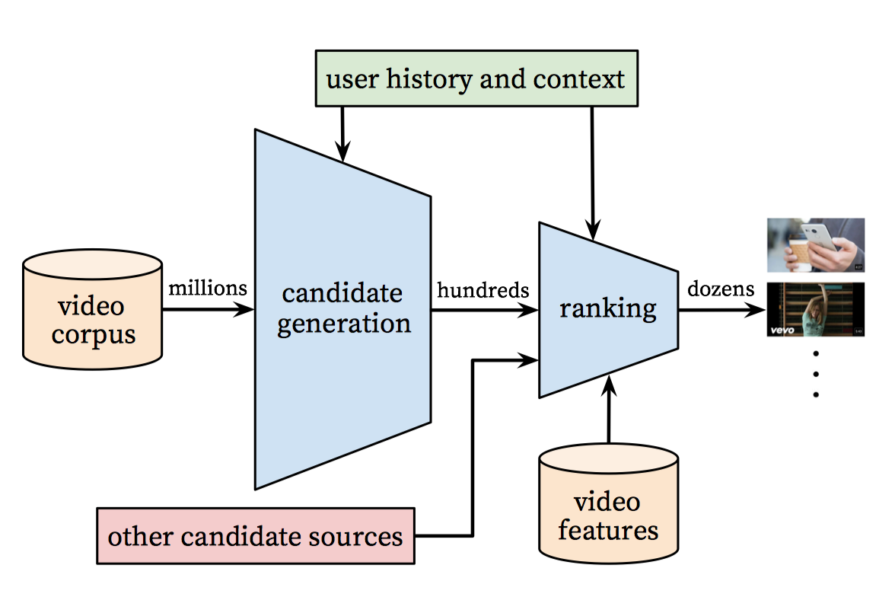
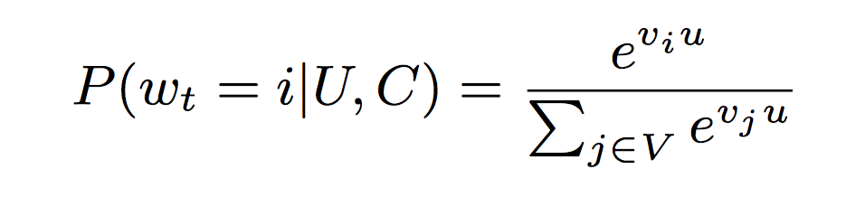
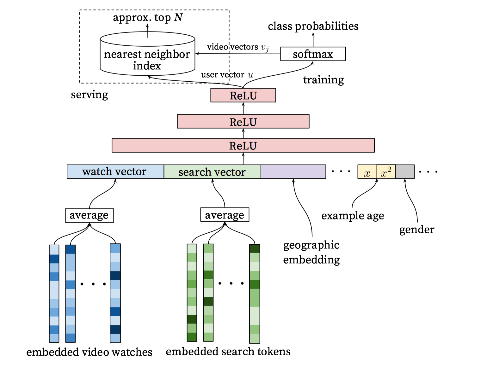

# YouTube DNN

## 摘要

作为一家用户数量多达数十亿的视频网站，YouTube拥有现有规模最大、最复杂的行业推荐系统。在本文中，我们从较高角度介绍了该系统，并着重于深度学习所带来的显著性能的提升。本文根据经典的两阶段进行切分：首先介绍了**深度候选生成模型**，其次介绍了**深度排序模型**。我们还提供了从设计、迭代和维护庞大的面向众多用户的推荐系统中获得的一些实践经验和见解。

## 介绍

作为全球最大创造、分享、探索视频内容的网站，YouTube推荐业务帮助数百万用户从日益增长的视频库中发现满足个性化需求的视频内容。在这篇文章中，我们主要关注深度学习给YouTube视频推荐系统所带来的巨大影响。

YouTube视频推荐面临以下3方面的挑战：

1. Scale：**视频用户数量巨大**。很多推荐算法也许在小规模用户时有效果，但在用户数量巨大时则不行。基于YouTube巨大的用户和视频数量，必须用高度定制化的分布式学习算法和有效的在线服务来处理。
2. Freshness：**视频更新频繁，用户行为更新频繁**。推荐系统需要反应迅速，对新上传的视频和用户最新的行为建模，并且在推荐新内容和已有内容时做好平衡。
3. Noise：由于**历史用户行为的稀疏性和行为本质上属于用户的隐式反馈**，我们极少获得用户满足度的真实事实，而是对嘈杂的隐式反馈信号进行建模。此外，与内容相关联的元数据的结构较差，没有明确定义本体。因此，我们的算法必须对训练数据的这些特定特征具有**鲁棒性**。

本文第2节是系统概述；第3节详细介绍了候选生成模型，包括如何训练以及使用；第4节详细介绍了排序模型，包括如何修改经典的逻辑斯蒂回归训练模型预测预期观看时间（而非点击概率），实验结果表明，隐藏层的深度对此情况是有帮助的。最后第5节介绍了我们的结论和经验教训。

## 系统概述

推荐系统的总体结构图如下所示，该系统由两个神经网络组成：一个用于候选集生成，一个用于排序。

**候选生成网络**从用户的YouTube使用历史记录中获取事件作为输入，并从大型语料库中检索出一小部分（数百个）视频，这些视频与用户高度相关。此网络通过类似协同过滤的方式提供了广泛的个性化视频。至于用户与用户之间的相似性主要根据观看过的视频ID、搜索查询词和人口学特征等粗粒度的特征来表达。

要想提供一些最好的推荐结果需要细粒度的表示来区分具有较高召回率的候选视频的重要性程度。**排序网络**可以根据期望的目标函数，结合视频和用户的丰富特征，完成对每个视频的打分。根据打分的结果，向用户展示得分最高的几个视频。

这种推荐的两阶段范式使我们可以在视频内容呈现大规模时也能进行推荐，同时可以确保推荐给用户的结果是个性化的，能够吸引用户。此外，这种两阶段的设计能够融合其他来源生成的候选集，如上图所示。

## 候选生成网络

### 将推荐转化为分类问题

在生成候选集的过程中，庞大的YouTube语料库会议筛选出与用户有关的数百个视频，以前我们使用的是基于rank loss的矩阵分解方法。我们的神经网络的早期迭代基于用户历史观看的视频embedding，通过浅层的网络模仿这种分解行为。从这个角度看，我们现在的方法可以看作是分解技术的非线性扩展。

可以把推荐问题建模成一个超大规模的多分类问题，即在时刻t，为用户U（上下文信息C）在视频库V中精准的预测出视频i的类别（每个具体的视频视为一个类别，i即为一个类别），用数学公式表达如下：

这里u表示用户、上下文的高维embedding向量，假设为N维。vj表示每一个候选视频的embedding向量（维度也为N）。embeddiiing嵌入是一种将稀疏实体（单个视频、用户等）映射到N维空间的稠密向量。深度神经网络的任务是根据用户的历史和上下文信息来学习用户的embedding向量，用户embedding向量对于softmax分类器区分视频非常有帮助。

我们使用观看视频的隐式反馈来训练模型，用户完成观看视频就是一个正例。该选择基于可用的隐式用户历史记录的数量级，使我们能够在显示反馈及其稀疏的尾部深处产生推荐。

为了有效训练具有数百万个类别的模型，我们使用了candidate sampling方法抽取负样本，然后通过重要性加权对样本进行校正。对于每一个样本，使得正样本和负样本的交叉熵损失最小化，在实践中，采样数千个负样本，对应于传统采样方法取得了100倍以上的加速。另外一种可选的抽样方法是 hierarchical softmax采样，但是使用它的准确性不够好，在层级softmax中，遍历树中的每个节点都涉及区分通常不相关的类集，从而使得分类问题更难，性能也会降低。

在投放时，需要计算最有可能的N个视频，以便推送给用户。在数十毫秒的严格服务等待时间下对数百万个项目完成评分需要一种近似的评分方案，该评分方案在会压缩、减少类别的个数。YouTube以前的系统依赖于hash散列，这里的分类器使用类似的方法。由于服务时不需要来自softmax输出层的（经过校正的）似然，因此评分问题可以转化为使用通用库的点积在空间中的最近邻搜索。我们发现A/B测试结果对最近邻搜索算法的选择不是特别敏感。

### 模型结构

受连续词袋（CBOW）语言模型的启发，我们在固定的词汇表中为每个视频学习学习高维词向量，并将这些词向量输入至前馈神经网络中。用户的观看历史可由长度可变的稀疏视频ID序列表示，这些序列通过词嵌入映射成稠密向量。该网络需要固定大小的向量输入，并简单地对各种不同的词向量进行平均。词向量是通过正常的梯度下降反向传播方法与其他模型参数一起学习得到的。所有特征向量拼接在一起组成网络的第一层，然后之后连接几层ReLU。下图显示了网络结构，还包含了除了观看视频以外的其他特征。

神经网络中可以加入不同类型的特征，不管是连续数值还是离散型特征。在上图中，还加入了用户的搜索词特征，经过embedding向量化以后求平均作为对应的search vector。

此外人口统计特征对于提供先验信息很重要，因此对于新用户推荐来说加入此特征是有帮助的。用户的地理位置、所使用的设备可以嵌入并连接在一起。其他的如性别、登录状态、年龄等特征都可以直接输入到网络中（归一化后）。

### 标签和上下文选择

训练样本是从YouTube网站上所有观看的视频中生成的，而不仅仅是根据我们产生的推荐观看的视频。同时，为每个用户生成固定数量的视频样本，从而有效防止一小部分高活跃用户的行为你对损失函数造成影响。

### 有关特征和网络深度的实验

**特征**：使用All Features > Watches, Searches & Example Age > Watches Only

**网络深度**：3-4层效果最佳

